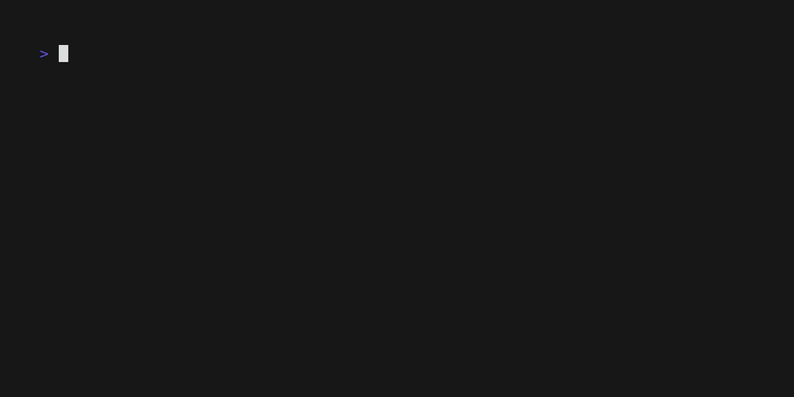

<!-- Improved compatibility of back to top link: See: https://github.com/othneildrew/Best-README-Template/pull/73 -->
<a name="readme-top"></a>


<!-- PROJECT SHIELDS -->
<!--
*** I'm using markdown "reference style" links for readability.
*** Reference links are enclosed in brackets [ ] instead of parentheses ( ).
*** See the bottom of this document for the declaration of the reference variables
*** for contributors-url, forks-url, etc. This is an optional, concise syntax you may use.
*** https://www.markdownguide.org/basic-syntax/#reference-style-links
-->
[![Contributors][contributors-shield]][contributors-url]
[![Forks][forks-shield]][forks-url]
[![Stargazers][stars-shield]][stars-url]
[![Issues][issues-shield]][issues-url]
[![MIT License][license-shield]][license-url]


<!-- PROJECT LOGO -->
<br />
<div align="center">
  <a href="https://github.com/sarvsav/iza">
    
  </a>

<h3 align="center">Iza</h3>

  <p align="center">
    Streamline platform operations with Linux inspired commands written in Go!
    <br />
    <a href="https://sarvsav.github.io/iza/"><strong>📘 Explore the docs  »</strong></a>
    <br />
    <br />
    <a href="https://calendly.com/sarvsav">📅 Book a meeting</a>
    ·
    <a href="https://github.com/sarvsav/iza/issues/new?assignees=sarvsav&labels=bug%2Cneeds-triage&projects=&template=01_bug_report.yml">🐛 Report Bug</a>
    ·
    <a href="https://github.com/sarvsav/iza/issues/new?assignees=sarvsav&labels=enhancement%2Cneeds-triage&projects=&template=02_feature_request.yml"> 🔨 Request Feature</a>
  </p>
</div>


<!-- TABLE OF CONTENTS -->
<details>
  <summary>Table of Contents</summary>
  <ol>
    <li>
      <a href="#about-the-project">About The Project</a>
      <ul>
        <li><a href="#built-with">Built With</a></li>
      </ul>
    </li>
    <li>
      <a href="#getting-started">Getting Started</a>
      <ul>
        <li><a href="#prerequisites">Prerequisites</a></li>
        <li><a href="#installation">Installation</a></li>
      </ul>
    </li>
    <li><a href="#usage">Usage</a></li>
    <li><a href="#roadmap">Roadmap</a></li>
    <li><a href="#license">License</a></li>
    <li><a href="#contact">Contact</a></li>
    <li><a href="#contributors">Contributors</a></li>
    <li><a href="#acknowledgments">Acknowledgments</a></li>
    <li><a href="#thankyou">Thank You</a></li>
  </ol>
</details>


<!-- ABOUT THE PROJECT -->
## About The Project

[![Iza][product-screenshot]](https://sarvsav.github.io/iza/)

I would like to thank **Iza** for inspiring me to build this project and it is dedicated to her.

With Iza, you can easily manage your mongodb operations if you are having an experience with linux shell commands.

For example, you can simply run `iza touch demo/buna_ziua` to create a new empty collection named `buna_ziua` in the database named `demo`. The new commands will come as an update to the project.

The details about the project can be found on [project website](https://sarvsav.github.io/iza/).

<p align="right">(<a href="#readme-top">back to top</a>)</p>


### Built With

[![Go][Golang]][Go-url]
<br>
[![docusaurus][docusaurus]][docusaurus-url]

<p align="right">(<a href="#readme-top">back to top</a>)</p>


<!-- GETTING STARTED -->
## Getting Started

Describe your software architecture design as life, not the buildings. Software architecture is very relatable to life, as it has dynamics, meaning, purpose and lot of things. Your software exists for greater good.

### Prerequisites

You need to have Go installed on your machine to run the project.

### Installation

`iza` is distributed as single binary with no dependencies and can be installed using the `go install` command.

```sh
go install github.com/sarvsav/iza/cmd/iza@latest
```

<!-- USAGE EXAMPLES -->
## Usage

Running `touch` for mongodb to create empty collections.

```sh
iza touch hello/buna_ziua
```



Running `ls` for mongodb and listing databases as well as collections.

```sh
iza ls -l # For long listing
```


Running `cat` for mongodb and printing documents for the collections.

```sh
iza cat demo/buna_ziua
```


Running `du` for mongodb and printing size for the collections.

```sh
iza du sample_mflix
```


Running `whoami` for mongodb and log level as debug.

```sh
iza whoami
```


_For more information, please refer to the [Documentation](https://sarvsav.github.io/iza/)_

<p align="right">(<a href="#readme-top">back to top</a>)</p>


<!-- ROADMAP -->
## Roadmap

See the [open issues](https://github.com/sarvsav/iza/issues) for a full list of proposed features (and known issues).

<p align="right">(<a href="#readme-top">back to top</a>)</p>


<!-- LICENSE -->
## License

Distributed under the MIT License. See [LICENSE](./LICENSE) for more information.

<p align="right">(<a href="#readme-top">back to top</a>)</p>


<!-- CONTACT -->
## Contact

Project Link: [https://github.com/sarvsav/iza](https://github.com/sarvsav/iza)

<p align="right">(<a href="#readme-top">back to top</a>)</p>

<!-- CONTRIBUTORS -->
## Contributors

Big thanks to our contributors. Contributions of any kind are welcome!

Issues with the label `good first issue` are a good place to start.

<a href="https://github.com/sarvsav/iza/graphs/contributors">
  
</a>

Made with [contrib.rocks](https://contrib.rocks).

Kindly refer to the [contributing guide](./CONTRIBUTING.md) to contribute to the project.

<p align="right">(<a href="#readme-top">back to top</a>)</p>

<!-- ADOPTERS -->
## Adopters

📢 If you're using iza in your organization, please add your name or company name to this [list](./ADOPTERS.md).

By adding yourself to the [ADOPTERS.md](./ADOPTERS.md) file, you help increase the project's visibility and credibility, which is essential for its growth.

<p align="right">(<a href="#readme-top">back to top</a>)</p>

<!-- ACKNOWLEDGMENTS -->
## Acknowledgments

- [Best-README-Template](https://github.com/othneildrew/Best-README-Template)

<p align="right">(<a href="#readme-top">back to top</a>)</p>

<!-- Thank You -->
## Thankyou

If you appreciate this project, please consider showing your support by ⭐ starring it, 🔄 sharing it with your friends, or 💖 making a donation. Thank you!

<!-- MARKDOWN LINKS & IMAGES -->
<!-- https://www.markdownguide.org/basic-syntax/#reference-style-links -->
[contributors-shield]: https://img.shields.io/github/contributors/sarvsav/iza.svg?style=for-the-badge
[contributors-url]: https://github.com/sarvsav/iza/graphs/contributors
[forks-shield]: https://img.shields.io/github/forks/sarvsav/iza.svg?style=for-the-badge
[forks-url]: https://github.com/sarvsav/iza/network/members
[stars-shield]: https://img.shields.io/github/stars/sarvsav/iza.svg?style=for-the-badge
[stars-url]: https://github.com/sarvsav/iza/stargazers
[issues-shield]: https://img.shields.io/github/issues/sarvsav/iza.svg?style=for-the-badge
[issues-url]: https://github.com/sarvsav/iza/issues
[license-shield]: https://img.shields.io/github/license/sarvsav/iza.svg?style=for-the-badge
[license-url]: https://github.com/sarvsav/iza/blob/master/LICENSE.txt
[product-screenshot]: assets/iza.png
[Golang]: https://img.shields.io/github/go-mod/go-version/sarvsav/iza?style=for-the-badge&logo=go
[Go-url]: https://go.dev/
[Bazel]: https://img.shields.io/badge/Bazel-v7-brightgreen?style=for-the-badge&logo=bazel
[Bazel-url]: https://bazel.build/
[docusaurus]: https://img.shields.io/badge/docs-passing-green?style=for-the-badge&logo=docusaurus&logoColor=%233ECC5F
[docusaurus-url]: https://docusaurus.io/